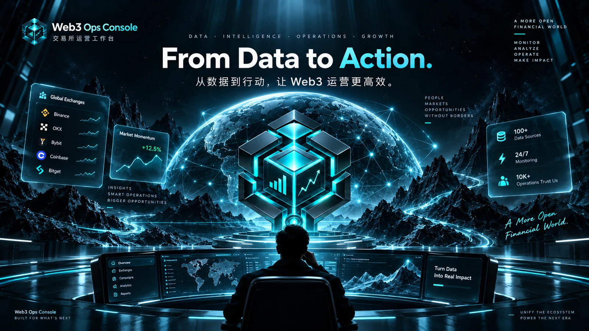
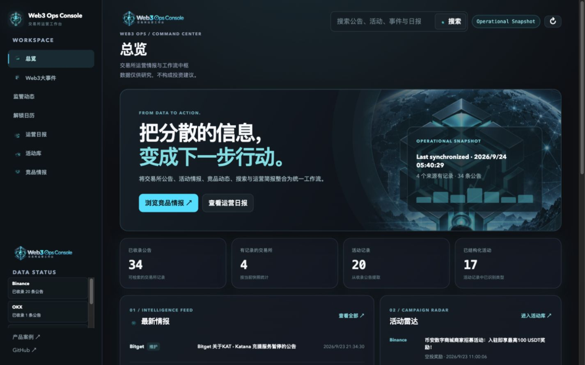

# Web3 Ops Console

[中文文档](./README.zh.md) · [Case study](./docs/CASE_STUDY.md) · [Acceptance record](./docs/ACCEPTANCE.md)

**Live Showcase:** [Open Web3 Ops Console](https://web3-ops-console.levi3399.chatgpt.site)

**From Data to Action.** An exchange operations workspace for collecting announcements, classifying campaigns, comparing sources, searching records, and drafting operations briefs.

Built as a functional product case that turns exchange operations experience into a browsable workflow. Contact: [@levibuilds](https://github.com/levibuilds).

> Data is for operations research only and does not constitute investment advice.

## Brand visual

The image below is concept art from the [visual kit](./assets/visual-kit/README.md). Its illustrated interface and numbers are design references, not product data or an actual screenshot.



## Product

Exchange and Web3 operations teams work across fragmented competitor announcements, campaign updates, market events, and daily reports. The console brings these tasks into one operating surface.

```text
Collect -> Normalize -> Classify -> Search -> Analyze -> Brief
```

## Actual product screenshots

Actual local product screens using the verified public-data snapshot captured on 2026-09-24:

| Overview | Intelligence | Reports | Search | Mobile |
| --- | --- | --- | --- | --- |
| [Open](./docs/screenshots/overview-visual-kit-1440.png) | [Open](./docs/screenshots/intelligence-production-1440.png) | [Open](./docs/screenshots/reports-production-1440.png) | [Open](./docs/screenshots/search-production-1440.png) | [Open](./docs/screenshots/overview-visual-kit-390.png) |



<!-- SNAPSHOT_COUNTS_START -->
The current [production snapshot](./public/production-snapshot.json) contains **34 announcements from 4 verified exchange sources, 20 campaign records, 17 structured**; collected at 2026-09-23 22:40 UTC.
<!-- SNAPSHOT_COUNTS_END -->

Each included announcement has an original title, source URL, publication timestamp, and fetch timestamp. OKX currently links to its dated announcement listing page; the other three collectors provide article URLs. The snapshot timestamp is stored in the JSON and shown in the UI. It does not imply continuous collection. The other configured exchange sources were not counted as successfully indexed.

## Features

- **Overview:** source-backed counts, recent intelligence, campaign radar, exchange comparison, and a visible snapshot timestamp.
- **Intelligence and campaigns:** browsable, filterable announcements and extracted activities with links to source pages.
- **Operations Brief:** a rule-based summary of saved records. Model polishing is optional and was not used for this snapshot.
- **Search:** keyword search across the saved announcements, campaigns, and events.
- **Operational mode:** optional collection, SQLite persistence, watchlists, alerts, webhooks, and model integrations remain in the existing Node service.

## Architecture

```text
Exchange announcements / Web3 news / CoinGecko / DefiLlama / X / Etherscan / Webhooks
        -> ingest
        -> normalize
        -> classify
        -> alert
        -> Web3 events / regulatory radar / rules brief / campaign library / competitor intel
        -> SQLite persistence (operational mode)
        -> exported JSON (read-only showcase mode)
```

## Data Flow

The verified snapshot uses the project's existing Binance, Bybit, and Bitget announcement APIs plus OKX's dated announcement page. Generic homepage text extraction can misidentify page text and assign fetch time as publication time, so its records were excluded from this snapshot. Export with `node scripts/export-production-snapshot.mjs http://127.0.0.1:4177` after running a local collector with `TRUSTED_SOURCES_ONLY=1`.

## AI Usage

Classification, comparison, keyword search, and the saved snapshot brief use rules and data processing. Optional server-side model calls can translate titles, polish live-mode briefs, and assist with selected alerts. This snapshot did not call a model.

## Data Status

**Operational Snapshot.** The repository includes a historical public-data snapshot; collection can be restarted when required. It is not 24/7 monitoring. The saved timestamp and per-record source, publication time, and fetch time are in [production-snapshot.json](./public/production-snapshot.json).

## Refresh Snapshot

Run `npm run refresh-snapshot` to start a temporary local collector, synchronize the four trusted exchange sources, validate the results, and atomically replace the saved JSON. Failed validation keeps the previous snapshot. The [manual GitHub Action](./.github/workflows/refresh-snapshot.yml) offers the same on-demand path and creates a commit only when files change; it has no schedule.

## Deployment

The portfolio showcase is a static read-only build: `npm run build:showcase`. It reads the JSON directly in the browser and needs no server, SQLite writer, model key, notifications, or automatic collection. The full operational Node service remains available separately. See [deployment notes](./deploy.md).

## Local Development

Read-only showcase, with no automatic collection, notifications, or writes:

```bash
npm ci
HOST=127.0.0.1 PORT=4178 SNAPSHOT_MODE=1 npm run dev
```

Operational mode retains the original local behavior and its own SQLite data directory:

```bash
HOST=127.0.0.1 PORT=4173 npm run dev
```

Open `http://127.0.0.1:4178/` for the read-only showcase, or `http://127.0.0.1:4173/` for operational mode.

Without keys, operational mode starts with empty local records. To load isolated demonstration records, explicitly run `DEMO_MODE=1 DATA_DIR=/path/to/separate-demo-data HOST=127.0.0.1 npm run dev`. The showcase screenshots above use the separate public-data snapshot.

## Environment

```text
OPENAI_API_KEY=                 # optional AI polishing / translation
COINGECKO_API_KEY=              # optional market data quota
CRYPTOPANIC_API_KEY=            # optional news source
DEFILLAMA_API_KEY=              # optional unlock/emissions source
X_BEARER_TOKEN=                 # optional KOL monitoring
ETHERSCAN_API_KEY=              # optional whale transfer source
TELEGRAM_BOT_TOKEN=             # optional push
FEISHU_WEBHOOK_URL=             # optional push
WECOM_WEBHOOK_URL=              # optional push
DISCORD_WEBHOOK_URL=            # optional push
```

## API

| Method | Path | Purpose |
| --- | --- | --- |
| `GET` | `/api/state` | Dashboard state bundle |
| `POST` | `/api/sync` | Sync live data sources |
| `POST` | `/api/sync-web3-news` | Sync Web3 events |
| `GET` | `/api/web3-news` | Top Web3 events |
| `GET` | `/api/regulation` | Regulatory radar items |
| `POST` | `/api/sync-unlocks` | Sync unlock calendar |
| `GET` | `/api/unlocks` | Unlock calendar |
| `POST` | `/api/sync-exchanges` | Sync exchange announcements |
| `GET` | `/api/exchange-announcements` | Classified competitor announcements |
| `GET` | `/api/listing-race` | Listing race table |
| `GET` | `/api/campaigns` | Structured campaign library |
| `GET` | `/api/daily-report` | 24h operations daily brief |
| `GET` | `/api/weekly-report` | Weekly operations report |
| `GET` | `/api/search` | Search announcements, campaigns, and events |
| `POST` | `/api/ingest` | Ingest one event |

In `SNAPSHOT_MODE=1`, write routes return 403; the saved daily brief and keyword search remain available. Weekly generation is unavailable in this mode.

## Tech Stack

Node.js 20+ (validated with 22.23.1), native HTTP server, browser JavaScript/CSS, SQLite via `better-sqlite3`, and a JSON export for the read-only snapshot.

## Project Context

This is a functional product case based on exchange operations workflows, not a claim of 24/7 live monitoring or verified business outcomes. Announcement counts measure this collection only. Listing comparisons use announcement publication times, not trading-open times. No model key is required to browse the snapshot or read its rule-based brief.

## Validation

```bash
npm run check
npm test
```

## License

MIT
