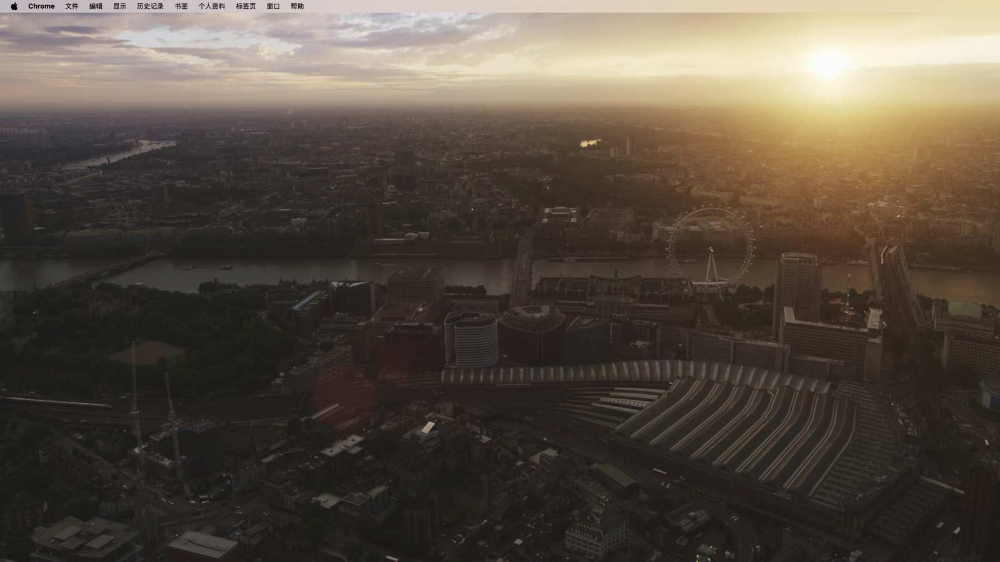
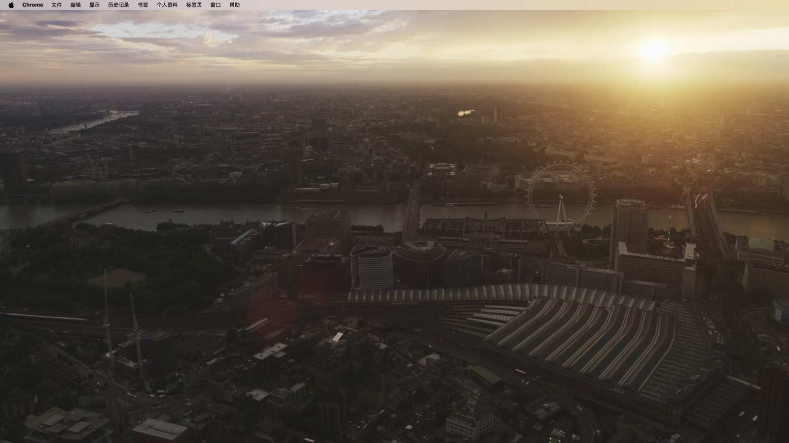

# web3-ops-console

[中文文档](./README.zh.md)

AI-powered operations console for Web3/exchange ops teams: competitor intel, regulatory radar, AI daily briefings & campaign library.

> Seeking Web3 Operations / AI Operations opportunities. Contact: [@levi2277999-gif](https://github.com/levi2277999-gif)

> Data is for operations research only and does not constitute investment advice.

## Why This Exists

Exchange and Web3 operations teams spend too much time watching competitors, reading fragmented announcements, checking regulatory news, tracking campaigns, and writing daily briefs. This console compresses those daily workflows into one focused operating surface.

```text
Watch competitors -> Scan Web3 events -> Read daily brief -> Mine campaigns -> Act
```

## Architecture

```text
Exchange announcements / Web3 news / CoinGecko / DefiLlama / X / Etherscan / Webhooks
        -> ingest
        -> normalize
        -> classify
        -> alert
        -> Web3 events / regulatory radar / AI daily brief / campaign library / competitor intel
        -> SQLite memory layer
```

## Screenshots

### Web3 Events


### Competitor Intel



### Daily Brief



### Campaign Library


## Features

- **Web3 events**: automatically collects and ranks the top daily Web3 news items.
- **20-exchange competitor intel**: tracks Binance, OKX, Bybit, Bitget, KuCoin, Gate, MEXC, HTX, Coinbase, Kraken and more.
- **Announcement classification**: listings, campaigns, trading competitions, deposit rewards, Launchpool, learn-and-earn, new user tasks, contracts/fees, maintenance, delistings, regulation, and other.
- **Listing race table**: compares when exchanges list the same token and highlights the first mover.
- **My exchange benchmark**: select your own exchange and see listing lag, campaign frequency comparison, and benchmark reminders in the daily report.
- **Regulatory radar**: tags SEC/SFC/MAS/FCA and other regulatory events by region, with critical alerts for lawsuits, bans, fines, and penalties.
- **Campaign library**: structured campaign records with exchange, type, token, date, title, and source link.
- **AI daily briefing**: market overview, key exchange updates, regulatory alerts, benchmark reminders, large on-chain moves, unlock calendar, and daily focus items.
- **Unlock calendar**: tracks upcoming token unlocks and flags large unlock events.
- **Global search**: searches announcements, campaigns, and events as an operations memory layer.
- **Push integrations**: Telegram, Feishu, WeCom, and Discord alert delivery.
- **Deployment-ready base**: SQLite persistence, Node test suite, GitHub Actions CI, Dockerfile, and deployment guide.

## Quick Start

```bash
npm install
cp .env.example .env
npm run dev
```

Open:

```text
http://localhost:4173
```

The app runs in demo mode without API keys.

## Environment

```text
OPENAI_API_KEY=                 # optional AI polishing / translation
COINGECKO_API_KEY=              # optional market data quota
CRYPTOPANIC_API_KEY=            # optional news source
DEFILLAMA_API_KEY=              # optional unlock/emissions source
X_BEARER_TOKEN=                 # optional KOL monitoring
ETHERSCAN_API_KEY=              # optional whale transfer source
TELEGRAM_BOT_TOKEN=             # optional push
FEISHU_WEBHOOK_URL=             # optional push
WECOM_WEBHOOK_URL=              # optional push
DISCORD_WEBHOOK_URL=            # optional push
```

## API

| Method | Path | Purpose |
| --- | --- | --- |
| `GET` | `/api/state` | Dashboard state bundle |
| `POST` | `/api/sync` | Sync live data sources |
| `POST` | `/api/sync-web3-news` | Sync Web3 events |
| `GET` | `/api/web3-news` | Top Web3 events |
| `GET` | `/api/regulation` | Regulatory radar items |
| `POST` | `/api/sync-unlocks` | Sync unlock calendar |
| `GET` | `/api/unlocks` | Unlock calendar |
| `POST` | `/api/sync-exchanges` | Sync exchange announcements |
| `GET` | `/api/exchange-announcements` | Classified competitor announcements |
| `GET` | `/api/listing-race` | Listing race table |
| `GET` | `/api/campaigns` | Structured campaign library |
| `GET` | `/api/daily-report` | 24h operations daily brief |
| `GET` | `/api/weekly-report` | Weekly operations report |
| `GET` | `/api/search` | Search announcements, campaigns, and events |
| `POST` | `/api/ingest` | Ingest one event |

## Validation

```bash
npm run check
npm test
```

## Roadmap

- Add public hosted demo.
- Improve extraction of campaign dates from long-form announcement pages.
- Expand regional regulatory dictionaries.
- Add richer benchmark analytics by exchange category and region.

## License

MIT
