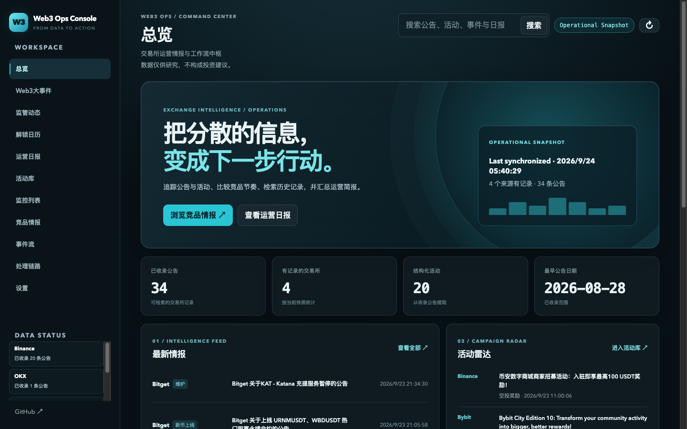

# Web3 Ops Console · 交易所运营工作台

[English](./README.md) · [案例说明](./docs/CASE_STUDY.md) · [验收记录](./docs/ACCEPTANCE.md)

**Live Showcase / 公开展示：**[打开交易所运营工作台](https://web3-ops-console.levi3399.chatgpt.site)

**From Data to Action.** 将交易所公告、活动情报、竞品动态、搜索和运营日报集中到统一工作流。这是一个基于交易所运营场景构建的可运行产品案例。

> 数据仅供运营研究，不构成投资建议。项目没有可核实的客户数、用户数或商业效果数据。

## Screenshots / 实际界面

以下截图来自本地实际运行的只读公开数据快照。概念视觉与产品截图分开管理；当前仓库没有用户先前提到的品牌资源包。

| Overview | Intelligence | Reports | Search |
| --- | --- | --- | --- |
| [查看](./docs/screenshots/overview-viewport-1440.png) | [查看](./docs/screenshots/intelligence-production-1440.png) | [查看](./docs/screenshots/reports-production-1440.png) | [查看](./docs/screenshots/search-production-1440.png) |



[活动库](./docs/screenshots/campaigns-production-1440.png) · [手机布局](./docs/screenshots/overview-production-390.png)

## Why / 为什么做

交易所运营信息分散在公告、Listing、Campaign、市场事件和竞品页面里。查找来源、对照发布时间、整理活动和撰写日报通常跨多个页面完成。工作台把这些步骤集中起来，让运营人员能搜索、比较并回到来源核验。

## Core Features / 核心功能

- **Exchange Intelligence：**浏览已采集的交易所公告，按来源筛选并查看链接。
- **Campaign Radar：**把收录的活动公告整理为可筛选的活动库。
- **Exchange Comparison：**比较当前收录范围内各交易所的公告数量；数量不是市场份额或交易量。
- **Search：**对公告、活动和事件做关键词检索；当前不是向量或语义搜索。
- **Operations Brief：**根据已保存记录生成规则版运营简报。
- **Alerts 与监控列表：**原有运营模式保留关键词命中、告警及配置入口；只读快照不发送通知。

## Workflow / 工作流

```text
Collect → Normalize → Classify → Search / Compare → Analyze → Operations Brief
```

原有 Node 服务可以按需采集，并使用 SQLite 保存运营数据。公开展示用 JSON 快照，服务端只读，不启动自动采集，也不调用通知接口。

## AI Usage / AI 使用边界

公告分类、检索、对比和本轮快照简报使用规则与数据处理。源码保留可选模型调用，用于标题翻译、日报润色与部分告警研判；需要单独配置服务端密钥。本轮公开快照**没有调用模型**，不能称为 AI 生成的日报。

## Data Status / 数据状态

<!-- SNAPSHOT_COUNTS_START -->
**Operational Snapshot。** [快照文件](./public/production-snapshot.json)当前记录 34 条去重公告、4 个已验证来源、20 条活动记录，其中 17 条完成结构化识别；采集时间为 2026-09-23 22:40 UTC。
<!-- SNAPSHOT_COUNTS_END -->

每条收录公告保留原始标题、来源 URL、发布时间与抓取时间。OKX 当前链接到带日期的公告列表页，其余三个来源提供文章链接。

源码配置了 20 个交易所来源，但本快照只统计上述 4 个有可核验记录的来源。通用网页抓取会把部分页面文字误判为公告，且可能把抓取时间当成发布时间，因此这些记录没有进入本快照。页面不宣称 24/7 实时运行；需要时可以重新启动采集。

## Refresh Snapshot / 按需更新

`npm run refresh-snapshot` 会启动临时采集服务、同步四个可信来源、核验无演示记录后原子替换快照。失败时保留旧文件。[GitHub 手动工作流](./.github/workflows/refresh-snapshot.yml)可按需运行，不设定时任务；内容未变化时不提交。

## Deployment / 部署

公开展示版由 `npm run build:showcase` 生成静态只读页面，在浏览器直接读取 JSON，无需 SQLite 写入、模型密钥、真实通知或自动采集。完整 Node 运营服务仍保留在源码中。参见[部署说明](./deploy.md)。

## Tech Stack / 技术栈

Node.js（要求 ≥20，本轮验证使用 22.23.1）、原生 HTTP 服务、浏览器 JavaScript/CSS、`better-sqlite3`、JSON 快照。项目没有 React/Next.js 迁移。

## Run Locally / 本地运行

已使用锁文件验证安装：

```bash
npm ci
HOST=127.0.0.1 PORT=4178 SNAPSHOT_MODE=1 npm run dev
```

打开 `http://127.0.0.1:4178/`。只读模式提供快照、搜索和已保存的规则简报；写入及同步请求返回 403，周报生成不可用。

原有运营模式：

```bash
HOST=127.0.0.1 PORT=4173 npm run dev
```

没有密钥时从空记录开始。密钥只放在本地 `.env` 或服务端环境变量，参考 [.env.example](./.env.example)；不要提交 `.env`。显式的 `DEMO_MODE=1` 使用独立数据目录并禁止真实采集和通知，不是本 README 截图所用数据。

## Project Context / 项目定位

这是一个 **Web3 / Exchange Operations Product Case Study**：展示业务问题、信息架构、规则工作流与可运行实现。它不是持续在线服务，也没有在此宣称企业客户或业务成果。上币比较依据公告发布时间，不等于交易开放时间；未收录公告不代表交易所没有相关活动。

## API 与验证

主要接口：`GET /api/state`、`GET /api/search`、`GET /api/campaigns`、`GET /api/daily-report`。运营模式另提供 `POST /api/sync`、`POST /api/sync-exchanges` 和告警/通知入口。详情见 [English README](./README.md) 和 [验收记录](./docs/ACCEPTANCE.md)。

```bash
npm run check
npm test
```

## License

MIT
